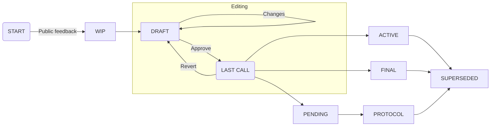

## Summary

TZIP (pronounce "tee-zip") stands for Tezos Improvement Proposal, which are
documents that explain how the Tezos blockchain works or how it ought to work.
This document is a TZIP which explains how we make more TZIPs.

## Abstract

Tezos is now a large and decentralized project, which can silo information and
inhibit collaboration across different projects, companies and continents.
This can lead to duplication of effort and low attention density on specific
issues. Poor information flow leads to resource misallocation and can
cause confusion in users and outside observers. At the same time, the
distributed nature of Tezos gives the project vitality and dynamism. As
they say in the game of Go: "Many eyes make life."

This document proposes a central clearinghouse for standards documents by
modifying the Ethereum Improvement Process to be a descriptive rather than a
prescriptive social institution. Unlike Ethereum, Tezos already has a
prescriptive decentralized governance institution: The quorum of Tezos bakers
and delegates. The goal of this proposal is to support that institution by
encouraging high quality technical discussion, documentation and, where
appropriate, non-binding standardization. Or to put it simply, Tezos already
has a Parliament, but now we need a *[Hansard]*

## What is a TZIP?

An TZIP is a design document providing information to the Tezos community,
describing a feature for Tezos or its processes or environment, and supporting
the formal protocol governance process.

The role of a TZIP is purely supplementary, hortative or descriptive; the Tezos
protocol is defined at all times by the implementation whose hash has been
incorporated into the current protocol ID and approved by the Tezos quorum.
TZIPs can and will diverge from and contradict one another, so long as all
active TZIPs remain compatible with the current protocol.

A TZIP should contain a concise technical specification and rationale which
unambiguously articulates what the proposal is, how it may be implemented, and
why the proposal is an improvement. A TZIP should additionally contain an FAQ,
which which documents, compares and answers alternative options, opinions and
objections.

Each TZIP has both authors and advocates, who may be (but are not required to
be) the same individuals. Whereas the *TZIP author* is responsible for
generating the proposal and any necessary accompanying materials, the *TZIP
advocate* is responsible for communicating the proposal to the community and
maintaing the TZIP FAQ. Healthy proposals should have multiple independent
advocates and a robust accompanying FAQ.

## TZIP Rationale

We intend TZIPs to be one possible mechanism for proposing new features, for
collecting community technical input on an issue, and for documenting the design
decisions that have gone into Tezos. TZIPs are maintained as text files in a
versioned repository; their revision history is a (possibly incomplete)
historical record of the feature proposal.

For Tezos developers, TZIPs can be a useful way to generate feedback, clearly
communicate functionality to users, and track the progress of their work.
Maintainers of Tezos tools and libraries can list the TZIPs that they have
implemented, which can give the community a convenient way to know the current
status of a given project.

There are many types of TZIP defined in [TZIP-2], where the TZIP Editors
maintain an up-to-date list. Unlike some other standardization schemas, instead
of purely numeric serial numbers, TZIPs use "TZIP indices", a system similar to
the Library of Congress Classification that mixes alphabetic topic prefixes
("A", "P", etc.) with serial numbers which may be extended with a `.` character
(e.g. `FAA1.2` is an extension of `FAA1`) This index namespace is also defined
in [TZIP-2].

It is highly recommended that a single TZIP contain a single key proposal or
new idea corresponding to its type. The more precise the TZIP, the more
successful it is likely to be.

A change to a single library or application may not require an TZIP, whereas a
change that affects multiple independent libraries or applications probably
does.

A TZIP must meet certain minimum criteria, which may change depending on the
TZIP type. Some TZIP types may require an attached reference implementation of
the proposed improvement. Other TZIP types may require two independent
implementations. If so, the associated software should be be of minimal possible
complexity and be focused primarily on illustrating the contents of the single
proposal to which it is attached. Reference implementations should show evidence
of correctness, ideally via formal methods, but at minimum via comprehensive
testing.

## TZIP Roles and Responsibilities:

Parties involved in the process are the:

- *TZIP authors* write proposals and accompanying materials and request TZIP
  status changes. In the case of multiple authors, the a single author will be
  designated as primary.

- *TZIP advocates* endorse proposals, seek community feedback and maintain the
  proposal FAQ

- *TZIP editors* advise authors and advocates on how to improve the quality of
  their proposal in all aspects (content, prose, implementation detail), ensure
  the compliance of the proposal and the process with relevant TZIPs, approve
  changes in proposal status, assign TZIP indices to proposals and maintain the
  TZIP index namespace as a whole.

- the *Tezos quorum* defines the Tezos protocol and approves all consensus
  critical amendments

### TZIP Editors

There currently are no TZIP Editors, pending the design and community or quorum
approval of a fair and legitimate process to select and remove Editors.

Once such a process is designed, the following is a list of candidates who have
expressed interest in serving as TZIP Editor:

[TODO: Add list]

For each submitted TZIP, the editors will select one or more editors to assume
responsibility for the proposal. This editor or editors will:

- Read the TZIP to check if complies with all relevant standards articulated in
  this document and elsewhere, both global TZIP standards and those particular
  to the TZIP type.

- Edit the TZIP for prose (spelling, grammar, sentence structure, etc.),
  markup (GitLab Flavored Markdown).

- Review any accompanying resources, such as implementations, proofs, papers,
  links, etc.

- Determine whether the FAQ fairly expresses and responds to criticisms of the
  proposal.

If the TZIP does not meet the standards at each of these stages, the editors
will send it back to the author for revision, with specific instructions. This
process may repeat as many times as necessary. The editors may additionally
refer the TZIP to outside reviewers with relevant knowledge. Editors may also
outright reject an TZIP submission which is unsuitable for review, or is
otherwise non-compliant with the standards outlined in relevant active TZIPs.

Should the editors approve the TZIP, they will:

- Assign a TZIP index to the proposal.

- Merge the corresponding pull request. The TZIP editors have sole ownership
  over the `tzip` GitLab repository.

- Coordinate any further steps with the TZIP authors and advocates, as required
  by the specific TZIP type.

The editors will at all stages of the TZIP process render fair and
impartial judgement. An editor cannot review a TZIP of which they are an
advocate or an author.

Throughout this process, the editors agree to follow and enforce TZIP Code of
Conduct, described in [TZIP-3: TZIP Code of Conduct][TZIP-3]

## TZIP Workflow

Authors should solicit feedback from the Tezos community first before submitting
their proposal to the editors. As prior work on the same or similar topics may
not be immediately apparent or accessible from publicly available information,
inviting community advice can both save time and effort and result in a stronger
proposal.

Examples of appropriate public forums to gauge response to a TZIP include [the
Tezos subreddit], [the Issues section of this repository], and [tzip Slack
channel]. In particular, [the Issues section of this repository] is an excellent
place to discuss your proposal.

A TZIP will move along the following process:

Each status change is requested by the primary TZIP author and reviewed by the
TZIP editors. Authors may use merge requests to update the status, which will
include links to relevant discussions of the TZIP. The TZIP editors will process
these requests as per the conditions below:

* **Work in progress (WIP)** -- Once the author has asked the Tezos
  community whether an idea has support, they will write a draft TZIP on
  their own fork of the `tzip` repository and submit a [merge request] with the
  `WIP` tag. Authors should include an implementation if this will aid people in
  studying the TZIP.
  * :arrow_right: Draft -- The Editors will review the merge request at a high
    level and determine if the TZIP is developed enough to proceed to the
    **Draft** stage.
  * :x: Draft -- Some possible reasons for denying draft status include being
    too unfocused, too broad, duplication of effort, being technically unsound,
    not providing proper motivation, addressing backwards compatibility, or
    having generated enough community interest through the advocates and the
    FAQ. If rejected, the editors will close the merge request.

* **Draft** -- Once the first draft has been approved, authors may submit
  follow-up commits with further changes to the draft until such point as they
  believe the TZIP to be mature and ready to proceed to the next status. Many
  types of TZIP in draft status must be implemented at least once to be
  considered for promotion to the next status.
  * :arrow_right: Last Call -- If agreeable, the TZIP editor will assign Last
    Call status and set a review end date (`review-period-end`).
  * :x: Last Call -- A request for Last Call status will be denied if material
    changes are still expected to be made to the draft. Editors expect that
    TZIPs only enter Last Call once.

* **Last Call** -- This TZIP will listed prominently on the
  https://tzip.dev/ website (subscribe via RSS at [last-call.xml])
  * :arrow_right: Pending -- TZIPs which require protocol amendment
    status.
  * :arrow_right: Protocol -- Informational TZIPs explicating the current
    protocol
  * :arrow_right: Active -- Most TZIPs will move to Active, which indicates that
    the TZIP is compatible with the current protocol, and may be updated without
    changing its TZIP index
  * :arrow_right: Final -- Some TZIPs may move to Final, which indicates that
    the TZIP is compatible with the current protocol, and may be updated without
    changing its TZIP index
  * :x: -- A Last Call which results in material changes or substantial
    unaddressed technical complaints will cause the TZIP to revert to Draft.

* **Pending** -- TZIPs awaiting vote in a future protocol amendment.
  * :arrow_right: Protocol -- Adoption by a vote of the Tezos quorum.
  * :x: -- A Pending TZIP which requires any changes will revert to Draft

* **Protocol** -- TZIPs which are part of the current protocol.
  * :x: -- Superseded -- Amended by a vote of the Tezos quorum.

* **Rejected** -- An TZIP that is fundamentally unsuitable without substantial
  improvements and additional public feedback.
  * :arrow_right: WIP -- The authors make substantial improvements and solicit
    additional public feedback.

* **Active** -- Most TZIPs will move to Active, which indicates that the TZIP is
  compatible with the current protocol, and may be updated without changing its
  TZIP index
  * :arrow_right: Superseded -- The TZIP is superseded by a new TZIP.

* **Final** -- Some TZIPs may move to Final, which indicates that
    the TZIP is compatible with the current protocol, and may be updated without
    changing its TZIP index
  * :arrow_right: Superseded -- The TZIP is superseded by a new TZIP.

* **Superseded** -- An TZIP which was previously Final, Active, or Protocol but
  has been replaced by another TZIP in Final, Active, or Protocol status,
  which will reference the Superseded TZIP

## What belongs in a successful TZIP?

Each TZIP should have the following parts:

- Preamble - RFC 822 style headers containing metadata about the TZIP, including
  the TZIP type, a short descriptive title (limited to a maximum of 44
  characters), and the author details. See [below] for details.

- Simple Summary - “If you can’t explain it simply, you don’t understand it well
  enough.” Provide a simplified and layman-accessible explanation of the TZIP

- Abstract - a short (200-500 word) description of the technical issue being
  addressed.

- Motivation - The motivation is critical for TZIPs that want to
  change the Tezos protocol. It should clearly explain why the existing
  protocol specification is inadequate to address the problem that the TZIP
  solves.

- Specification - The technical specification should describe the syntax and
  semantics of any new feature. The specification should be detailed enough to
  allow competing interoperable implementations.

- Rationale - The rationale fleshes out the specification by describing what
  motivated the design and why particular design decisions were made. It should
  describe alternate designs that were considered and related work, e.g. how the
  feature is supported in other languages. The rationale may also provide
  evidence of consensus within the community, and should discuss important
  objections or concerns raised during discussion.

- Backwards Compatibility - All TZIPs that introduce backwards incompatibilities
  or supersede other TZIPs must include a section describing these
  incompatibilities, their severity, and solutions.

- Test Cases - Test cases for an implementation are strongly recommended as are
  any proofs of correctness via formal methods.

- Implementations - Any implementation must be completed before any TZIP is
  given status “Last Call”, but it need not be completed before the TZIP is
  merged as draft.

- Copyright Waiver - All TZIPs must be in the public domain, or a under a
  permissive license substantially identical to placement in the public
  domain.See the bottom of this TZIP for an example copyright waiver.

## TZIP Formats and Templates

TZIPs should be written in [markdown] format.  Image files should be included in
a subdirectory of the `assets` folder for that TZIP as follow: `assets/tzip-X`
(for tzip **X**). When linking to an image in the TZIP, use relative links such
as `../assets/tzip-X/image.png`.

## TZIP Header Preamble

Each TZIP must begin with an RFC 822 style header preamble, preceded and
followed by three hyphens (`---`). The headers must appear in the following
order. Headers marked with "*" are optional and are described below. All other
headers are required.

` tzip:` <TZIP index code> (this is determined by the editor)

` title:` <TZIP title>

` author:` <a list of the author's or authors' name(s) and/or username(s), or
name(s) and email(s). Details are below.>

` advocate:` <a list of the advocate's or advocates' name(s) and/or username(s), or
name(s) and email(s).>

`* gratuity:` <a Tezos address controlled by an author capable of receiving
gratuities from grateful Tezoi>

` * discussions-to:` \<a url pointing to the official discussion thread\>

` status:` <WIP | Draft | Last Call | Final | Active | Pending | Protocol |
            Rejected | Superseded>

`* review-period-end:` <date review period ends>

` type:` Defined in TZIP-2:

` created:` <date created on>

` * updated:` <comma separated list of dates>

` * requires:` <TZIP indices)>

` * replaces:` <TZIP indices)>

` * superseded-by:` <TZIP indices>

Headers that permit lists must separate elements with commas.

Headers requiring dates will always do so in the format of ISO 8601 (yyyy-mm-dd).

#### `author` header

The `author` header optionally lists the names, email addresses or usernames of
the authors/owners of the TZIP. Those who prefer anonymity may use a username
only, or a first name and a username. The format of the author header value must
be:

> Random J. User &lt;address@dom.ain&gt;

or

> Random J. User (@username)

if the email address or GitLab username is included, and

> Random J. User

if the email address is not given.

#### `discussions-to` header

While an TZIP is a draft, a `discussions-to` header will indicate the mailing
list or URL/s where the TZIP is being discussed.

#### `type` header

The `type` header specifies the type of TZIP according to Appendix A.

#### `created` header

The `created` header records the date that the TZIP was assigned a number. Both
headers should be in `yyyy-mm-dd` format, e.g. 2001-08-14.

#### `updated` header

The `updated` header records the date(s) when the TZIP was updated with
"substantional" changes. This header is only valid for TZIPs of Draft and Active
status.

#### `requires` header

TZIPs may have a `requires` header, indicating the TZIP numbers that this TZIP
depends on.

#### `superseded-by` and `replaces` headers

TZIPs may also have a `superseded-by` header indicating that an TZIP has been
rendered obsolete by a later document; the value is the number of the TZIP that
replaces the current document. The newer TZIP must have a `replaces` header
containing the number of the TZIP that it rendered obsolete.

## Auxiliary Files

TZIPs may include auxiliary files such as diagrams. Such files must be named
TZIP-XXXX-Y.ext, where “XXXX” is the TZIP index (replacing `.` characters with
`_`), “Y” is a serial number (starting at 1), and “ext” is replaced by the
actual file extension (e.g. “png”).

## Transferring Primary Authorship

It occasionally becomes necessary to transfer primary authorship of TZIPs to a
new primary author. In such cases, the previous primary author will remain as a
co-author or an author emeritus. This can occur by unilateral decision of the
primary author, via request of a co-author and approval by the editors, or in
extraordinary circumstances unilateral decision of the editors.

## History

This document was derived heavily from Ethereum's [EIP-1] which was in turn
derived from [Bitcoin's BIP-0001] written by Amir Taaki and [Python's PEP-0001],
written by Barry Warsaw, Jeremy Hylton, and David Goodger. In many places text
was simply copied and modified. A further influence from `TZIP-1` was Martin
Pospěch's [tip-1].

None of the authors of [EIP-1], [BIP-0001], [PEP-0001] or [tip-1] text are
responsible for its use in the Tezos Improvement Process, and should not be
bothered with technical questions specific to TZIP. Please direct all comments
to the TZIP editors.

## Copyright

Copyright and related rights waived via
[CC0](https://creativecommons.org/publicdomain/zero/1.0/).

[Hansard]: https://en.wikipedia.org/wiki/Hansard
[TZIP-2]: /TZIP-2.md
[TZIP-3]: /TZIP-3.md
[Michelson]
[LIGO]
[SmartPy]
[Morley]
[Liquidity]
[Fi]
[the Issues section of this repository]
[merge request]
[last-call.xml]
[tip-1]: https://gitlab.com/tips2/TIPs/blob/master/TIPS/tip-1.md
[Ethereum's EIP-1]: https://github.com/ethereum/EIPs
[Bitcoin's BIP-0001]: https://github.com/bitcoin/bips
[Python's PEP-0001]: https://www.python.org/dev/peps/
