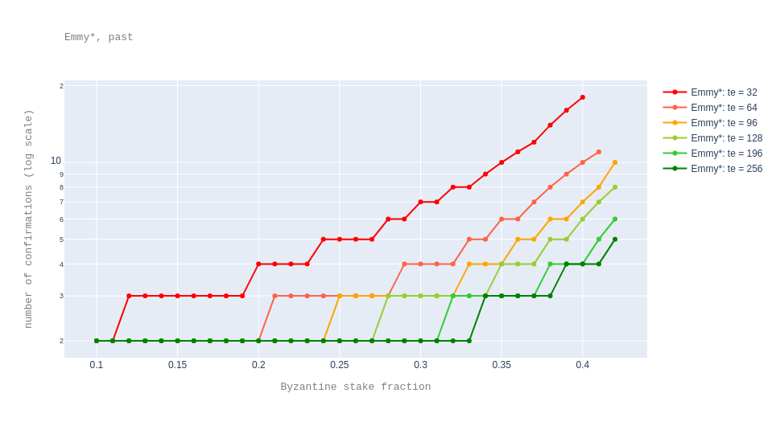

$\newcommand\ie{\mathit{ie}} \newcommand\dpp{\mathit{pd}} \newcommand\te{\mathit{te}} \newcommand\md{\mathit{md}} \newcommand\db{\mathit{bd}} \newcommand\de{\mathit{ed}} \newcommand\edelay{\mathit{emmy}^{\text{+}}\hspace{-.12cm}\_\mathit{delay}} \newcommand\esdelay{\mathit{emmy}^{\star}\hspace{-.12cm}\_\mathit{delay}} \newcommand\trz{\mathit{level\_reward\_zero}} \newcommand\tr{\mathit{level\_reward\_nonzero}} \newcommand\br{\mathit{block\_reward}} \newcommand\er{\mathit{endorsement\_reward}}$

# Faster Finality with Emmy&#9733;

## Summary

This TZIP proposes to replace Emmy+ by Emmy&#9733; for faster finality.

## Abstract

Emmy+ is the current consensus algorithm in Tezos. ([Emmy+](https://blog.nomadic-labs.com/emmy-an-improved-consensus-algorithm.html) improved on the original consensus algorithm, Emmy, presented in the [Tezos whitepaper](https://tezos.com/static/white_paper-2dc8c02267a8fb86bd67a108199441bf.pdf).) Being a Nakamoto-style consensus, Emmy+ provides probabilistic finality. A [previous analysis](https://blog.nomadic-labs.com/analysis-of-emmy.html) suggests that a user may be _reasonably sure_[^fin] that a block is final if it has 6 confirmations (that is, blocks on top of it) over a healthy chain[^healthy] when considering a Byzantine attacker with a stake fraction of 33% of the total active stake. Given that in a healthy chain blocks are baked every minute, 6 confirmations are equivalent to 6 minutes.

Emmy&#9733; updates Emmy+ by:

- a tweak[^ab] in the definition of the minimal delay function, and
- an increase in the number of endorsement slots per block

[^ab]: The tweak was suggested by Arthur Breitman.

both of which bring faster times to finality.

Concretely, in Emmy&#9733; a block can be produced with a delay of 30 seconds with respect to the previous block if it has priority 0 and more than half of the total endorsing power[^endos] per block. The number of endorsement slots per block is increased from 32 to say[^testnet] 256. <!--(This means that for a block to be produced after 30 seconds, it needs to have endorsements with at least 128 endorsing power.)-->

[^endos]: The *endorsing power* of a set of endorsements is the number of endorsement slots these endorsements represent.

[^testnet]: A testnet is in preparation to check that the new value of the `endorsers_per_block` constant, 256, does not have any negative impact.

With these changes, on a healthy chain and for a Byzantine attacker with 33% stake for instance, the number of confirmations decreases to 2 blocks, therefore 1 minute, a 6 fold improvement.

[^fin]: Here, _reasonably sure_ means "with probability smaller than some reasonable threshold", which we quantify as $5\cdot 10^{-9}$, which puts our expectation of being wrong about a block being final at roughly once every two centuries.

[^healthy]: We say a chain is *healthy* over a period of time if in this period blocks have priority 0 and (almost) all its endorsement slots are filled. A concrete healthiness measure is the delay of the chain with respect to the ideal chain where each block has a delay of one minute with respect to the previous block.

## Motivation

Emmy&#9733; is designed to provide faster finality than Emmy+, without compromising its security.

## Specification

### Minimal block delay formula

We recall that Emmy+ defines the **minimal block delay** of a block with respect to the previous block as a function of the current block's priority $p$, and the endorsing power $e$ of the endorsements included in the current block:

$$\edelay(p, e) = \db + \dpp \cdot p + \de\cdot \max(0, \ie - e).$$

Above

* $\db$ stands for base delay,
* $\dpp$ stands for priority delay (that is, delay per missed baking slot),
* $\de$ stands for delay per (missed) endorsement (slot),
* $\ie$ stands for initially required number of endorsements.

Since Babylon, the values of these parameters are set to: $\db = 60$, $\dpp=40$, $\de=8$, $\ie=24$.

Emmy&#9733; builds on top of the above definition while taking advantage of the observation that most blocks are baked at priority 0 and with almost all endorsements:

$$\esdelay(p, e) =
\left\{\begin{array}{ll}
\md & \mbox{ if } p = 0 \wedge e \geq \frac{\te}{2}\\
\edelay(p, e) & \mbox { otherwise}
\end{array}
\right.
$$

$\md$ is a new constant, called `minimal_block_delay`, whose value is proposed to be 30 seconds; while $\te$ refers to the existing constant `endorsers_per_block` whose value is changed from 32 to 256.

### Rewards

To keep roughly the same inflation rate as in Emmy+, in Emmy&#9733;, the reward values need to be updated. The reward formulas remain unchanged. We recall their definition from [Carthage](https://blog.nomadic-labs.com/a-new-reward-formula-for-carthage.html#methodology-of-reward-function-evaluation), in a slight reformulation:

$$\br(p,e) = \begin{cases}
   \frac{e}{\te} \cdot \trz \cdot \frac{1}{2} & \mbox{ if } p = 0\\
   \frac{e}{\te} \cdot \tr & \mbox{ otherwise }
   \end{cases}
$$

Above, $\trz$, resp. $\tr$ stands for reward per level at priority 0, resp. reward per level at a non-zero priority. Their values in Emmy+ are: $\trz = 80$ and $\tr=6$.

$$\er(p,e) = \begin{cases}
   block\_reward(0, e) & \mbox{ if } p = 0\\
   \frac{2}{3} \cdot block\_reward(0, e) & \mbox{ otherwise }
   \end{cases}
$$

Since with Emmy&#9733; there will normally be two times as many blocks per year, to preserve the inflation rate from Emmy+, $\trz$ and $\tr$ are updated to $40$, resp. $3$.

Therefore, rewards per endorsement slot are 16 times smaller in Emmy&#9733; versus Emmy+:

- 2 times smaller because blocks would be produced two times faster, and
- 8 times smaller because there are 8 times more endorsement slots per level.

Concretely,
* the constant `baking_reward_per_endorsement` is changed from `[ "1250000", "187500" ]` to `[ "78125", "11719" ]`;
* the constant `endorsement_reward` is changed from `[ "1250000", "833333" ]`  to `[ "78125", "52083" ]` (Recall that these are values in mutez.)

### Security deposits

The values of the security deposits are updated with respect to the new value of $\trz$:

*  $32 \cdot \frac{\trz}{2} = 32 \cdot \frac{40}{2} = 640$ for baking
*  $32 \cdot \frac{\trz}{2 \cdot \te} = 32 \cdot \frac{40}{2\cdot 256} = 2.5$ for endorsing.

This way, security deposits are proportional with the maximum reward. The constant 32 is the one used in Emmy.

## Rationale

Each of the [two mentioned updates](#Abstract) helps decrease the time to finality:
* Increasing the number of required endorsements makes nodes converge faster on the same chain. In other words, the number of confirmations decreases, as detailed below.
* While the new block delay formula does not help with decreasing the number of confirmations, it helps decrease the confirmation times simply by decreasing the time between blocks.

We note that simply decreasing the time between blocks in Emmy+ would not be a very sensible thing to do. This is because, as suggested by [the analysis of Emmy+ in the partial synchrony network model](https://blog.nomadic-labs.com/emmy-in-the-partial-synchrony-model.html), we have that the smaller the time between blocks (that is, the smaller the constant $\db$), the more sensitive is the algorithm to message delays. In Emmy&#9733;, time between blocks is decreased only when the network conditions are good (as otherwise not enough endorsements would be gathered in time).

The following plot shows the number of confirmations (in log scale) for different $\te$ values when varying the stake fraction from 0.1 to 0.45 and different numbers of total endorsements. This plot assumes the ["forks started in the past" scenario](https://blog.nomadic-labs.com/analysis-of-emmy.html#forks-started-in-the-past), meaning that we are interested in the finality of a block which already has a number of confirmations on top of it (and therefore, importantly, we know how healthy the chain was in the meanwhile), and we ask ourselves whether this number is sufficient. Here we assume a perfectly healthy chain.
In the plot, the highest red point corresponds to 18 confirmations.

To complement the above plot, the following table presents a subset of the data in text form. In the table, $f$ stands for the attacker's stake fraction and a value in the table gives the number of confirmation for a given $f$ and a given $\te$.

| $f$ \ $\te$ |   32 |   64 |   96 |   128 |   196 |   256 |
|--------:|-----:|-----:|-----:|------:|------:|------:|
| **0.1** |    2 |    2 |    2 |     2 |     2 |     2 |
| **0.15**|    3 |    2 |    2 |     2 |     2 |     2 |
| **0.2** |    4 |    2 |    2 |     2 |     2 |     2 |
| **0.25**|    5 |    3 |    3 |     2 |     2 |     2 |
| **0.3** |    7 |    4 |    3 |     3 |     2 |     2 |
| **0.33**|    8 |    5 |    4 |     3 |     3 |     2 |
| **0.35**|   10 |    6 |    4 |     4 |     3 |     3 |
| **0.4** |   18 |   10 |    7 |     6 |     4 |     4 |

The following plot shows the *expected* number of confirmations (in log scale) for different $\te$ values when varying the stake fraction from 0.1 to 0.45. This plot assumes the ["forks starting now" scenario](https://blog.nomadic-labs.com/analysis-of-emmy.html#forks-starting-now), meaning that we are interested in the finality of the last injected block. (The number are expectedly higher because we have no information about how healthy the chain will be.)
In the plot, the highest red point corresponds to 205 expected confirmations.

To complement the above plot, the following table presents a subset of the data in text form. As above, $f$ stands for the attacker's stake fraction and a value in the table gives the expected number of confirmation for a given $f$ and a given $\te$.

| $f$ \ $\te$ |   32 |   64 |   96 |   128 |   196 |   256 |
|---------:|-----:|-----:|-----:|------:|------:|------:|
| **0.1**  |    4 |    3 |    2 |     2 |     2 |     2 |
| **0.15** |    5 |    3 |    3 |     2 |     2 |     2 |
| **0.2**  |    7 |    4 |    3 |     3 |     2 |     2 |
| **0.25** |   10 |    6 |    4 |     3 |     3 |     2 |
| **0.3**  |   16 |    9 |    6 |     5 |     4 |     3 |
| **0.33** |   22 |   12 |    8 |     6 |     5 |     4 |
| **0.35** |   28 |   15 |   10 |     8 |     6 |     5 |
| **0.4**  |   67 |   34 |   22 |    17 |    12 |    10 |

## Backwards Compatibility

The format of endorsements changes to include the endorsement slot. This change enables checking an endorsement in constant time, instead of the current check which is linear in the total number of endorsement slots. However, the new format is a wrapper of the old format, and the slot field is not signed. Concretely, the `tezos-endorser` will produce the endorsement by having the signer stack provide the signature, then wrapping it with its slot, before injecting it in the node. In this way, the signing infrastructure of bakers does not need to change. Instead, this update will only introduce a breaking but light API change, mostly impacting block explorers and monitoring tools.

Another consequence is that cycles and voting periods will be almost two times shorter than they currently are.

## Security Considerations

As it was the case for Emmy+, we do not have a full security proof for Emmy&#9733;. However, our experiments suggest that Emmy&#9733; is more robust than Emmy+, due to the increase in the number of endorsement slots. Indeed, the case when the attacker is Byzantine was treated in the Rationale section above, while the case of economically rational players is briefly considered below.

### Selfish baking

We recall that the rewards in Carthage were defined in such a way that a non-cooperative baker obtains no "benefit" from [deflationary baking](https://blog.nomadic-labs.com/a-new-reward-formula-for-carthage.html). This was mainly obtained by having the reward for including an endorsement set to the same amount as the reward to have one endorsement included. As this property is still satisfied in Emmy&#9733;, we only consider here [selfish baking](https://blog.nomadic-labs.com/analysis-of-emmy.html). That is, an attacker tries to bake its own secret chain by withholding its own endorsements.

First, stealing just one block is not profitable, just from the definition of the delay function.

Second, by stealing two blocks, the expected gains are negligible. For instance for an attacker with 33% of stake the expected gain is $1.42233\cdot 10^{-23}$ tez. We note that the gains decrease with a higher $\te$ value. However, even for $\te=32$ the expected gains are tiny, namely $1.38303\cdot 10^{-12}$.

Finally, given that the probability of stealing more than 2 blocks is very low, the expected gains are even smaller in such cases.

<!-- ## Test Cases -->

## Implementations

* [MR](https://gitlab.com/tezos/tezos/-/merge_requests/2386) for Emmy&#9733;
* [MR](https://gitlab.com/tezos/tezos/-/merge_requests/2471) for improving the complexity of checking the validity of an endorsement; this MR changes the RPC API

<!-- ## Appendix -->

## Copyright

Copyright and related rights waived via [CC0](https://creativecommons.org/publicdomain/zero/1.0/).
