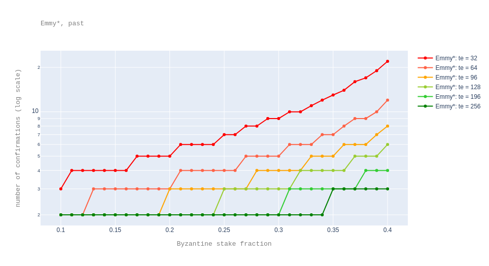
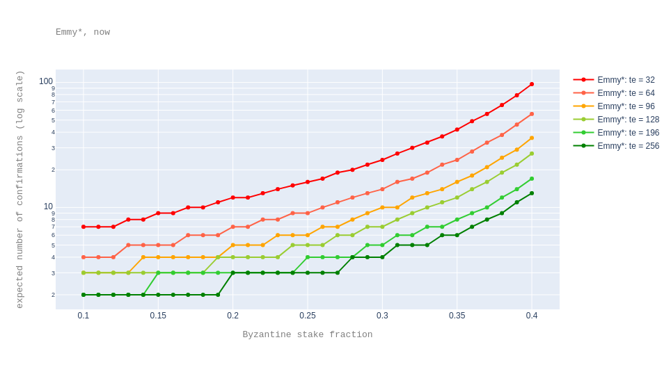

# Faster Finality with Emmy<sup>&#9733;</sup>

## Summary

This TZIP proposes to replace Emmy<sup>+</sup> by Emmy<sup>&#9733;</sup> for faster finality.

## Abstract

Emmy<sup>+</sup> is the current consensus algorithm in Tezos. ([Emmy<sup>+</sup>](https://blog.nomadic-labs.com/emmy-an-improved-consensus-algorithm.html) improved on the original consensus algorithm, Emmy, presented in the [Tezos whitepaper](https://tezos.com/static/white_paper-2dc8c02267a8fb86bd67a108199441bf.pdf).) Being a Nakamoto-style consensus, Emmy<sup>+</sup> provides probabilistic finality. A [previous analysis](https://blog.nomadic-labs.com/analysis-of-emmy.html) suggests that a user may be _reasonably sure_[^fin] that a block is final if it has 6 confirmations (that is, blocks on top of it) over a healthy chain[^healthy] when considering a Byzantine attacker with a stake fraction of 33% of the total active stake. Given that in a healthy chain blocks are baked every minute, 6 confirmations are equivalent to 6 minutes.
<a name="updates"></a>
Emmy<sup>&#9733;</sup> updates Emmy<sup>+</sup> by:

- a tweak[^ab] in the definition of the minimal delay function, and
- an increase in the number of endorsement slots per block

[^ab]: The tweak was suggested by Arthur Breitman.

both of which bring faster times to finality.

Concretely, in Emmy<sup>&#9733;</sup> a block can be produced with a delay of 30 seconds with respect to the previous block if it has priority 0 and more than 60% of the total endorsing power[^endos] per block. The number of endorsement slots per block is increased from 32 to say[^testnet] 256. <!--(This means that for a block to be produced after 30 seconds, it needs to have endorsements with at least 153 endorsing power.)-->

[^endos]: The *endorsing power* of a set of endorsements is the number of endorsement slots these endorsements represent.

[^testnet]: A testnet is in preparation to check that the new value of the `endorsers_per_block` parameter, 256, does not have any negative impact.

With these changes, on a healthy chain and for a Byzantine attacker with 33% stake for instance, the number of confirmations decreases to 2 blocks, therefore 1 minute, a 6 fold improvement.

[^fin]: Here, _reasonably sure_ means "with probability smaller than some reasonable threshold", which we quantify as `5 * 1e-9`, which puts our expectation of being wrong about a block being final at roughly once every two centuries.

[^healthy]: We say a chain is *healthy* over a period of time if in this period blocks have priority 0 and (almost) all its endorsement slots are filled. A concrete healthiness measure is the delay of the chain with respect to the ideal chain where each block has a delay of one minute with respect to the previous block.

## Motivation

Emmy<sup>&#9733;</sup> is designed to provide faster finality than Emmy<sup>+</sup>, without compromising its security.

## Specification

### Minimal block delay formula

We recall that Emmy<sup>+</sup> defines the **minimal block delay** of a block with respect to the previous block as a function of the current block's priority `p`, and the endorsing power `e` of the endorsements included in the current block:
```
  emmy+_delay(p, e) = bd + pd * p + ed * max(0, ie - e)
```

Above

* `bd` stands for base delay,
* `pd` stands for priority delay (that is, delay per missed baking slot),
* `ed` stands for delay per (missed) endorsement (slot),
* `ie` stands for initially required number of endorsements.

Since [Babylon](https://tezos.gitlab.io/protocols/005_babylon.html#emmy), the values of these parameters are set to: `bd = 60`, `pd = 40`, `ed = 8`, `ie = 24`.

Emmy<sup>&#9733;</sup> builds on top of the above definition while taking advantage of the observation that most blocks are baked at priority 0 and with almost all endorsements:
```
  emmy*_delay(p, e) =
    md                   if p = 0 and e >= 3*te/5
    emmy+_delay(p, e)    otherwise
```

where `md` is a new parameter, called `minimal_block_delay`, whose value is proposed to be 30 seconds; while `te` refers to the existing parameter `endorsers_per_block` whose value is changed from 32 to 256. Also, the value of `ed` changes from 8 to 4.

### Rewards

To keep roughly the same inflation rate as in Emmy<sup>+</sup>, in Emmy<sup>&#9733;</sup>, the reward values need to be updated. The reward formulas remain unchanged. We recall their definition from [Carthage](https://blog.nomadic-labs.com/a-new-reward-formula-for-carthage.html#methodology-of-reward-function-evaluation), in a slight reformulation:

```
  baking_reward(p, e) =
    (level_rewards_prio_zero / 2) * e / te    if p = 0
    level_rewards_prio_nonzero * e / te       otherwise
```

Above, `level_rewards_prio_zero`, resp. `level_rewards_prio_nonzero` stands for rewards per level at priority 0, resp. rewards per level at a non-zero priority. Their values in Emmy<sup>+</sup> are: `level_rewards_prio_zero = 80` and `level_rewards_prio_nonzero = 6`.

```
  endorsing_reward(p, e) =
    baking_reward(0, e)          if p = 0
    baking_reward(0, e) * 2/3    otherwise
```

Since with Emmy<sup>&#9733;</sup> there will normally be two times as many blocks per year, to preserve the inflation rate from Emmy<sup>+</sup>, in Emmy<sup>&#9733;</sup> `level_rewards_prio_zero = 40` and `level_rewards_prio_nonzero = 3`.

Therefore, the rewards per endorsement slot are 16 times smaller in Emmy<sup>&#9733;</sup> versus Emmy<sup>+</sup>:

- 2 times smaller because blocks would be produced two times faster, and
- 8 times smaller because there are 8 times more endorsement slots per level.

Concretely,

* the parameter `baking_reward_per_endorsement` is changed from `["1250000", "187500"]` to `["78125", "11719"]`;
* the parameter `endorsement_reward` is changed from `["1250000", "833333"]`  to `["78125", "52083"]`.

(Recall that these are values in mutez.)


### Security deposits

The values of the security deposits are updated with respect to the new value of `level_rewards_prio_zero`:

*  `32 * level_rewards_prio_zero / 2 = 32 * 40 / 2 = 640` tez for baking,
*  `32 * level_rewards_prio_zero / 2 / te = 32 * 40 / (2 * 256) = 2.5` tez for endorsing.

This way, security deposits are proportional with the maximum reward. The parameter value 32 is the one used in Emmy.

## Rationale

Each of the [two mentioned updates](#Abstract) helps decrease the time to finality:

* Increasing the number of required endorsements makes nodes converge faster on the same chain. In other words, the number of confirmations decreases, as detailed below.
* While the new block delay formula does not help with decreasing the number of confirmations, it helps decrease the confirmation times simply by decreasing the time between blocks.

We note that simply decreasing the time between blocks in Emmy<sup>+</sup> would not be a very sensible thing to do. This is because, as suggested by [the analysis of Emmy<sup>+</sup> in the partial synchrony network model](https://blog.nomadic-labs.com/emmy-in-the-partial-synchrony-model.html), we have that the smaller the time between blocks (that is, the smaller the parameter `bd`), the more sensitive is the algorithm to message delays. In Emmy<sup>&#9733;</sup>, time between blocks is decreased only when the network conditions are good (as otherwise not enough endorsements would be gathered in time).

The following plot shows the number of confirmations (in log scale) for different `te` values when varying the stake fraction from 0.1 to 0.45 and different numbers of total endorsements. This plot assumes the ["forks started in the past" scenario](https://blog.nomadic-labs.com/analysis-of-emmy.html#forks-started-in-the-past), meaning that we are interested in the finality of a block which already has a number of confirmations on top of it (and therefore, importantly, we know how healthy the chain was in the meanwhile), and we ask ourselves whether this number is sufficient. Here we assume a perfectly healthy chain.
In the plot, the highest red point corresponds to 22 confirmations.



To complement the above plot, the following table presents a subset of the data in text form. In the table, `f` stands for the attacker's stake fraction and a value in the table gives the number of confirmation for a given `f` and a given `te`.

| `f` \\ `te` |   32 |   64 |   96 |   128 |   196 |   256 |
|--------:|-----:|-----:|-----:|------:|------:|------:|
|    **0.1**  |    3 |    2 |    2 |     2 |     2 |     2 |
|    **0.15** |    4 |    3 |    2 |     2 |     2 |     2 |
|    **0.2**  |    5 |    3 |    3 |     2 |     2 |     2 |
|    **0.25** |    7 |    4 |    3 |     3 |     2 |     2 |
|    **0.3**  |    9 |    5 |    4 |     3 |     2 |     2 |
|    **0.33** |   11 |    6 |    5 |     4 |     3 |     2 |
|    **0.35** |   13 |    7 |    5 |     4 |     3 |     3 |
|    **0.4**  |   22 |   12 |    8 |     6 |     4 |     3 |

The following plot shows the *expected* number of confirmations (in log scale) for different `te` values when varying the stake fraction from 0.1 to 0.45. This plot assumes the ["forks starting now" scenario](https://blog.nomadic-labs.com/analysis-of-emmy.html#forks-starting-now), meaning that we are interested in the finality of the last injected block. (The number are expectedly higher because we have no information about how healthy the chain will be.)
In the plot, the highest red point corresponds to 97 expected confirmations.



To complement the above plot, the following table presents a subset of the data in text form. As above, `f` stands for the attacker's stake fraction and a value in the table gives the expected number of confirmation for a given `f` and a given `te`.

| `f` \\  `te` |   32 |   64 |   96 |   128 |   196 |   256 |
|--------:|-----:|-----:|-----:|------:|------:|------:|
|    **0.1**  |    7 |    4 |    3 |     3 |     2 |     2 |
|    **0.15** |    9 |    5 |    4 |     3 |     3 |     2 |
|    **0.2**  |   12 |    7 |    5 |     4 |     3 |     3 |
|    **0.25** |   16 |    9 |    6 |     5 |     4 |     3 |
|    **0.3**  |   24 |   14 |   10 |     7 |     5 |     4 |
|    **0.33** |   33 |   19 |   13 |    10 |     7 |     5 |
|    **0.35** |   42 |   24 |   16 |    12 |     8 |     6 |
|    **0.4**  |   97 |   56 |   36 |    27 |    17 |    13 |


Finally, changing `ed` from 8 to 4 increases the number of endorsement
slots that make the difference between being able to inject a "slow
path" block at priority 0 and a block at priority 1. Note that a
higher difference decreases the chances of a race condition between
such blocks. This difference is given by `pd/ed`. For `ed=8`, this
difference was of `5` endorsements slots, while with `ed=4` the
difference is of `10` endorsements slots. Changing `ed` from 8 to 4
also has the advantage of decreasing the block delay in the unlikely
case that there are very few endorsements included in a block. For
instance, in the worst case where there are 0 endorsements at priority
0, with `ed=4`, `emmy*_delay(0, 0)` is 14 minutes, while with `ed=8`,
`emmy*_delay(0, 0)` is 27 minutes. We note however that by making `ed`
smaller the probability of forks increases, as less weight is given to
endorsements.

## Backwards Compatibility

To keep the duration of cycles and voting period the same, their length in number of blocks is doubled. The number of seed nonce commitments per cycle and of roll snapshots per cycle are kept the same. Concretely, the following parameters and their values in Emmy<sup>+</sup>
```
      blocks_per_cycle = 4096
      blocks_per_voting_period = 20480
      blocks_per_commitment = 32
      blocks_per_roll_snapshot = 256
```
are changed to the following values in Emmy<sup>&#9733;</sup>:
```
      blocks_per_cycle = 8192
      blocks_per_voting_period = 40960
      blocks_per_commitment = 64
      blocks_per_roll_snapshot = 512
```

Also, to be able to reduce block propagation times, which depend on the block validation times, the value of the parameter `hard_gas_limit_per_block` is halved (from `10,400,000` to `5,200,000` gas units).

Finally, we note that the Michelson `NOW` instruction keeps the same
intuitive meaning, namely it pushes on the stack the minimal injection
time for the current block. However, this minimal injection time is
not 1 minute after the previous block's timestamp as in
Emmy<sup>+</sup>, but just 30 seconds after.

## Security Considerations

As it was the case for Emmy<sup>+</sup>, we do not have a full security proof for Emmy<sup>&#9733;</sup>. However, our experiments suggest that Emmy<sup>&#9733;</sup> is more robust than Emmy<sup>+</sup>, due to the increase in the number of endorsement slots. Indeed, the case when the attacker is Byzantine was treated in the Rationale section above, while the case of economically rational players is briefly considered below.

### Selfish baking

We recall that the rewards in Carthage were defined in such a way that a non-cooperative baker obtains no "benefit" from [deflationary baking](https://blog.nomadic-labs.com/a-new-reward-formula-for-carthage.html). This was mainly obtained by having the reward for including an endorsement set to the same amount as the reward to have one endorsement included. As this property is still satisfied in Emmy<sup>&#9733;</sup>, we only consider here [selfish baking](https://blog.nomadic-labs.com/analysis-of-emmy.html). That is, an attacker tries to bake its own secret chain by withholding its own endorsements.

Our experiments show that, by stealing one or two blocks, the expected
gains are tiny. For instance, for an attacker with 33% of stake, the
expected gain for stealing one block is `0.000314898` tez. Assuming
that blocks are baked twice as fast as in Emmy<sup>+</sup>, this would
amount to a profit of 331 tez per year. Given that the probability of
stealing more than 2 blocks is very low, the expected gains are even
smaller in such cases.

<!-- ## Test Cases -->

## Implementations

* [MR](https://gitlab.com/tezos/tezos/-/merge_requests/2386) for Emmy<sup>&#9733;</sup>'s new block delay formula
* [MR](https://gitlab.com/tezos/tezos/-/merge_requests/2531) for the change of `blocks_per_cycle` and related constants

<!-- ## Appendix -->

## Copyright

Copyright and related rights waived via [CC0](https://creativecommons.org/publicdomain/zero/1.0/).

## Footnotes
